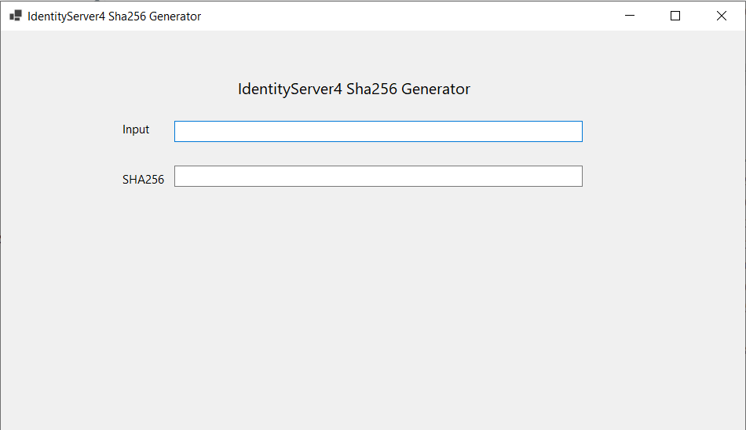

# IdentityServer4.Sha256Generator-exe

# Usage:
Double click the file "IdentityServer4.Sha256Generator.exe", and it will show up the UI

Put the string in the "Input" field, and in the "Sha256" field, it will show the corresponding SHA256 string.
