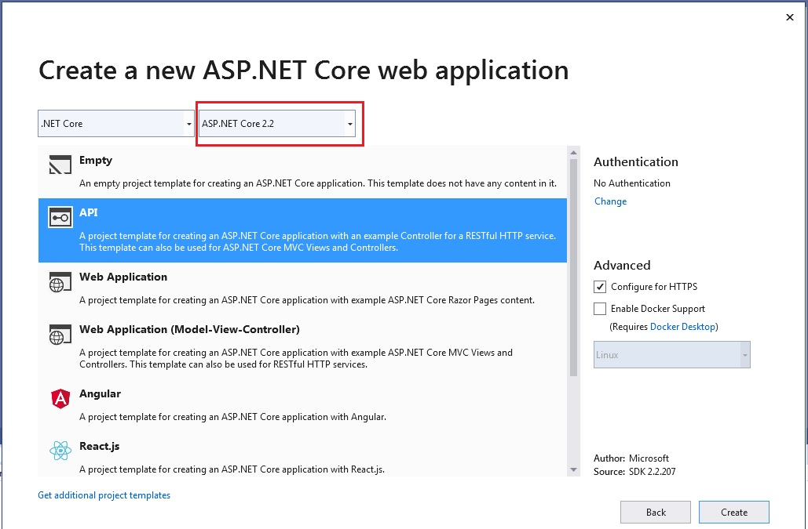
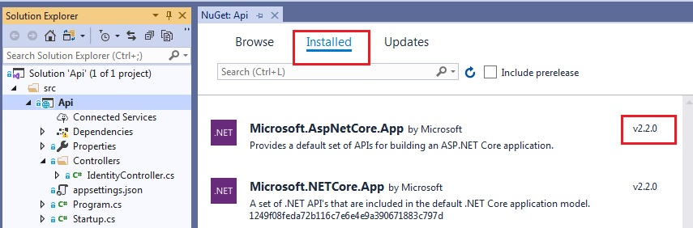
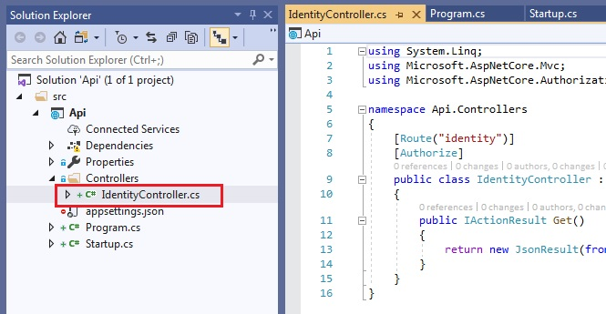
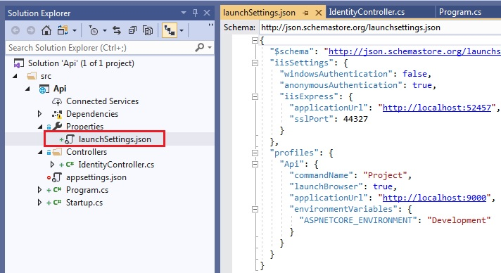
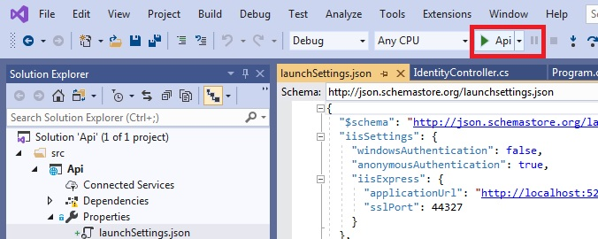
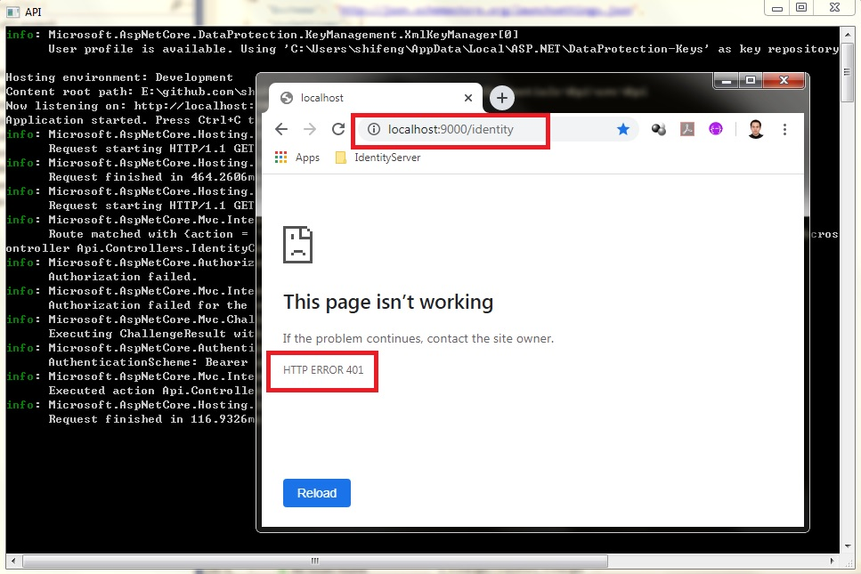

# Quickstart #1.2: Setup Api application in VS 2019

The doc and code here is derived from the tutorial [Client Credentials](http://docs.identityserver.io/en/latest/quickstarts/1_client_credentials.html). But I removed some unnecessary code and tried it on Visual Studio 2019.

For quick trying and experience, you can download the Git code and run it. But if you want to set up the project from scratch, here is the step by step guide.

## Step by step

The following doc is to show how to create the Api project in Visual Studio 2019.

### Create project

Firstly, let's create a new project in VS 2019. As project should be included in a solution, you can add the new project into an empty solution, or an existing one.

Create an "ASP.NET Core Web Application" project and name it as "Api". But please note: the template should be "API" and the "ASP.NET Core" version should be 2.2. Due to some package compatibility issue (show later), we won't use higher version, such as 3.1. We may fix this issue in the future.


So far the project is created. Then we will configure it and add code.

### Install package

Install package "Microsoft.AspNetCore.App v2.2.0". Please note, v2.2.0 is not the latest version. As the project "ASP.NET Core" version is 2.2, here we install the compatible version of the package. 


### Code change

Create controller file, (or rename existing default controller file to), IdentityController.cs


Controllers/IdentityController.cs
```C#
using System.Linq;
using Microsoft.AspNetCore.Mvc;
using Microsoft.AspNetCore.Authorization;

namespace Api.Controllers
{
    [Route("identity")]
    [Authorize]
    public class IdentityController : ControllerBase
    {
        public IActionResult Get()
        {
            return new JsonResult(from c in User.Claims select new { c.Type, c.Value });
        }
    }
}
```

And then change code on Program.cs and Startup.cs

Program.cs
```C#
using System;
using Microsoft.AspNetCore;
using Microsoft.AspNetCore.Hosting;

namespace Api
{
    public class Program
    {
        public static void Main(string[] args)
        {
            Console.Title = "API";

            BuildWebHost(args).Run();
        }

        public static IWebHost BuildWebHost(string[] args) =>
            WebHost.CreateDefaultBuilder(args)
                .UseStartup<Startup>()
                .Build();
    }
}
```

Startup.cs
```C#
using Microsoft.AspNetCore.Builder;
using Microsoft.Extensions.DependencyInjection;

namespace Api
{
    public class Startup
    {
        public void ConfigureServices(IServiceCollection services)
        {
            services.AddMvcCore(option => { option.EnableEndpointRouting = false; })
                .AddAuthorization()
                .AddJsonFormatters();

            services.AddAuthentication("Bearer")
                .AddJwtBearer("Bearer", options =>
                {
                    options.Authority = "http://localhost:5000";
                    options.RequireHttpsMetadata = false;

                    options.Audience = "api1";
                });
        }

        public void Configure(IApplicationBuilder app)
        {
            app.UseAuthentication();
            app.UseMvc();
        }
    }
}
```

### file of launch settings

Now change the launchSettings.json. In this file, make sure "profiles" first element is "Api", and its applicationUrl is http://localhost:9000.


Properties/launchSettings.json
```json
{
  "$schema": "http://json.schemastore.org/launchsettings.json",
  "iisSettings": {
    "windowsAuthentication": false,
    "anonymousAuthentication": true,
    "iisExpress": {
      "applicationUrl": "http://localhost:52457",
      "sslPort": 44327
    }
  },
  "profiles": {
    "Api": {
      "commandName": "Project",
      "launchBrowser": true,
      "applicationUrl": "http://localhost:9000",
      "environmentVariables": {
        "ASPNETCORE_ENVIRONMENT": "Development"
      }
    }
  }
}
```
So far, the configuration and code change are both done.

### Start project and check URL

Start project by clicking the launch button


If everything is correct, there should be a popup console, and brower show up. In the brower, check the URL

http://localhost:9000/identity

There should be HTTP 401 error, which means "Unauthorized". This is expected as the request is not authenticated.



