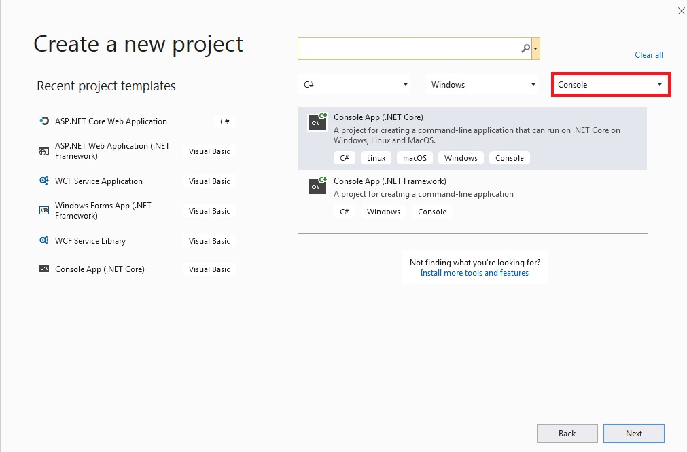
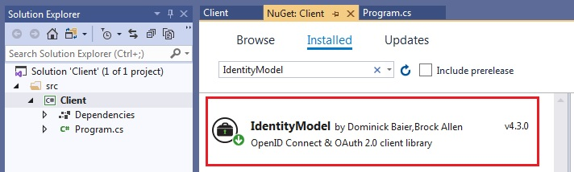
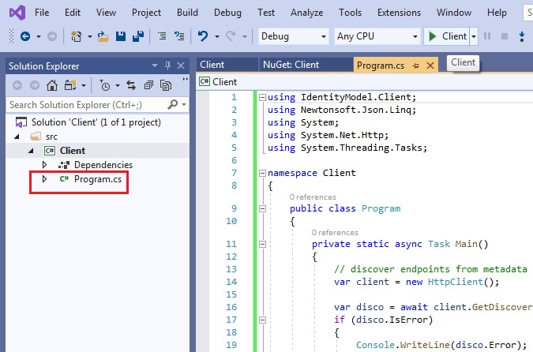
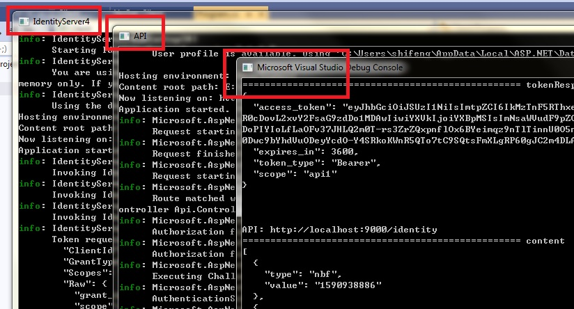

# Quickstart #1.3: Setup Client application in VS 2019

The doc and code here is derived from the tutorial [Client Credentials](http://docs.identityserver.io/en/latest/quickstarts/1_client_credentials.html). But I removed some unnecessary code and tried it on Visual Studio 2019.

For quick trying and experience, you can download the Git code and run it. But if you want to set up the project from scratch, here is the step by step guide.

This is the 1.3 section of the doc.  And we assume you have walkthrough the 1.1 section [Setup IdentityServer](../IdentityServer) and 1.2 section [Setup Api](../Api)

## Step by step

The following doc is to show how to create the Api project in Visual Studio 2019.

### Create project

Firstly, let's create a new project in VS 2019. As project should be included in a solution, you can add the new project into an empty solution, or an existing one.

Create a "Console App (.Net Core) project, and project name is "Client".


So far the project is created. Then we will configure it and add code.

### Install package

Install project "IdentityModel"


### Code change

In this console project, the only code change is in the file Program.cs


Program.cs
```C#
using IdentityModel.Client;
using Newtonsoft.Json.Linq;
using System;
using System.Net.Http;
using System.Threading.Tasks;

namespace Client
{
    public class Program
    {
        private static async Task Main()
        {
            // discover endpoints from metadata
            var client = new HttpClient();

            var disco = await client.GetDiscoveryDocumentAsync("http://localhost:5000");
            if (disco.IsError)
            {
                Console.WriteLine(disco.Error);
                return;
            }

            // request token
            var tokenRequest = new ClientCredentialsTokenRequest
            {
                Address = disco.TokenEndpoint,
                ClientId = "client",
                ClientSecret = "secret",
                Scope = "api1"
            };
            var tokenResponse = await client.RequestClientCredentialsTokenAsync(tokenRequest);
            if (tokenResponse.IsError)
            {
                Console.WriteLine(tokenResponse.Error);
                return;
            }
            Console.WriteLine("================================================== tokenResponse.Json");
            Console.WriteLine(tokenResponse.Json);
            Console.WriteLine("\n\n");

            // call api
            var apiClient = new HttpClient();
            apiClient.SetBearerToken(tokenResponse.AccessToken);

            var apiUrl = "http://localhost:9000/identity";
            var response = await apiClient.GetAsync(apiUrl);
            Console.WriteLine("API: " + apiUrl);
            if (!response.IsSuccessStatusCode)
            {
                Console.WriteLine(response.StatusCode);
                return;
            }
            var content = await response.Content.ReadAsStringAsync();
            Console.WriteLine("================================================== content");
            Console.WriteLine(JArray.Parse(content));
        }
    }
}
```

So far, the configuration and code change are both done.

### Start project and check URL

Before start the Client project, we need to start up the [IdentityServer](../IdentityServer) project and [Api](../Api) project. If everything is correct, we should be able to see output like this.


