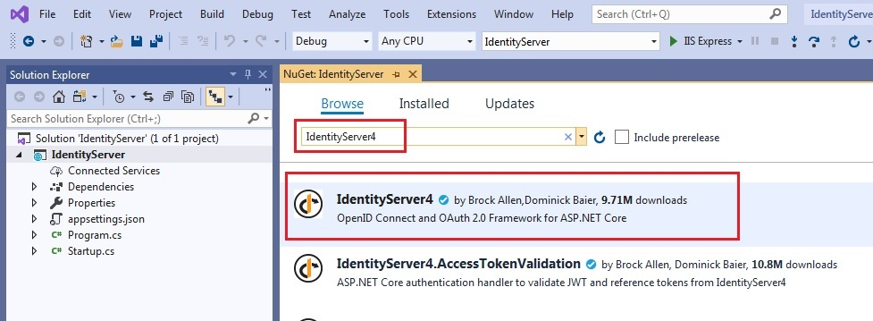

# Quickstart #1.1: Setup IdentityServer app in VS 2019

The doc and code here is derived from the tutorial [Client Credentials](http://docs.identityserver.io/en/latest/quickstarts/1_client_credentials.html). But I removed some unnecessary code and tried it on Visual Studio 2019.

For quick trying and experience, you can download the Git code and run it. But if you want to set up the project from scratch, here is the step by step guide.

## Step by step

The following doc is to show how to create the IdentityServer project in Visual Studio 2019.

### Create project

Firstly, let's create a new project in VS 2019. As project should be included in a solution, you can add the new project into an empty solution, or an existing one.

In VS 2019, right click the solution name, click "Add", and then click "New Project..."


Select the project type as "ASP.NET Core Web Application"


Specify the project name as "IdentityServer"


Choose "Empty" template and click "Create" button.


So far the project is created. Then we will configure it and add code.

### Install package

Install "IdentityServer4" package. Right click the project name, select "Manage NuGet Package..."


In the "NuGet" tab, search "IdentityServer4", and install it.


### Code change

Create a new C# class file, Config.cs. By default, VS 2019 does not generate this file. So we have to create it manually.


Config.cs
```C#
using IdentityServer4.Models;
using System.Collections.Generic;

namespace IdentityServer
{
    public static class Config
    {
        public static IEnumerable<IdentityResource> GetIdentityResources()
        {
            return new IdentityResource[] { new IdentityResources.OpenId() };
        }

        public static IEnumerable<ApiResource> GetApis()
        {
            return new List<ApiResource> { new ApiResource("api1", "My API") };
        }

        public static IEnumerable<Client> GetClients()
        {
            return new List<Client>
            {
                new Client
                {
                    ClientId = "client",

                    // no interactive user, use the clientid/secret for authentication
                    AllowedGrantTypes = GrantTypes.ClientCredentials,

                    // secret for authentication
                    ClientSecrets = { new Secret("secret".Sha256()) },

                    // scopes that client has access to
                    AllowedScopes = { "api1" }
                }
            };
        }
    }
}
```

Also, we need to make code change in Program.cs and Startup.cs. These 2 files are generated by VS 2019 by default.

Program.cs
```C#
using Microsoft.AspNetCore;
using Microsoft.AspNetCore.Hosting;
using System;

namespace IdentityServer
{
    public class Program
    {
        public static void Main(string[] args)
        {
            Console.Title = "IdentityServer4";

            CreateWebHostBuilder(args).Build().Run();
        }

        public static IWebHostBuilder CreateWebHostBuilder(string[] args)
        {
            return WebHost.CreateDefaultBuilder(args).UseStartup<Startup>();
        }
    }
}
```

Startup.cs
```C#
using System;
using Microsoft.AspNetCore.Builder;
using Microsoft.AspNetCore.Hosting;
using Microsoft.Extensions.DependencyInjection;
using Microsoft.Extensions.Hosting;

namespace IdentityServer
{
    public class Startup
    {
        public IWebHostEnvironment Environment { get; }

        public Startup(IWebHostEnvironment environment)
        {
            Environment = environment;
        }

        public void ConfigureServices(IServiceCollection services)
        {
            var builder = services.AddIdentityServer()
                .AddInMemoryIdentityResources(Config.GetIdentityResources())
                .AddInMemoryApiResources(Config.GetApis())
                .AddInMemoryClients(Config.GetClients());

            if (Environment.IsDevelopment())
            {
                builder.AddDeveloperSigningCredential();
            }
            else
            {
                throw new Exception("need to configure key material");
            }
        }

        public void Configure(IApplicationBuilder app)
        {
            if (Environment.IsDevelopment())
            {
                app.UseDeveloperExceptionPage();
            }

            app.UseIdentityServer();
        }
    }
}
```

### Launch settings

Lastly, check the Properties/launchSettings.json. Make sure the "IdentityServer" is the first element of the "profiles". And its applicationUrl is http://localhost:5000


Properties/launchSettings.json
```json
{
  "iisSettings": {
    "windowsAuthentication": false, 
    "anonymousAuthentication": true, 
    "iisExpress": {
      "applicationUrl": "http://localhost:51101",
      "sslPort": 44385
    }
  },
  "profiles": {
    "IdentityServer": {
      "commandName": "Project",
      "launchBrowser": true,
      "applicationUrl": "http://localhost:5000",
      "environmentVariables": {
        "ASPNETCORE_ENVIRONMENT": "Development"
      }
    }
  }
}
```

### Start project and check URL

So far, all the configuration and code change are done. Let's launch the project. When the project launches, there will be console popup and a browser show up. In this doc, the default browser is Chrome.


If everything is correct, the browser should be able to get JSON response from the following URL

http://localhost:5000/.well-known/openid-configuration

By default the JSON resposne should be not formatted. But in this doc, the Chrome has installed "JSON Viewer Awesome". So the resposne is formatted as you see.


