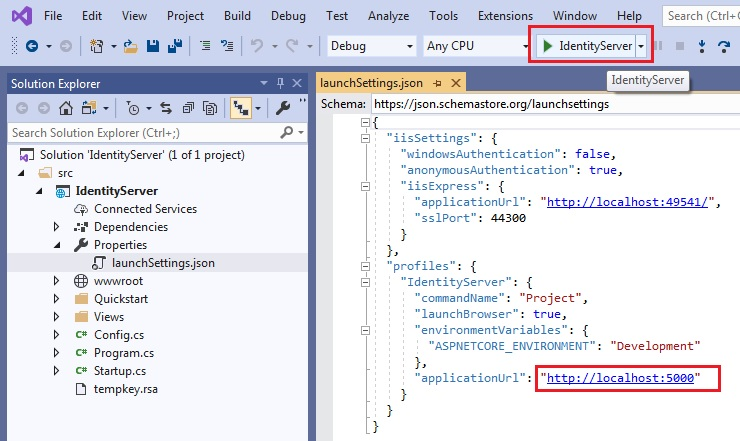
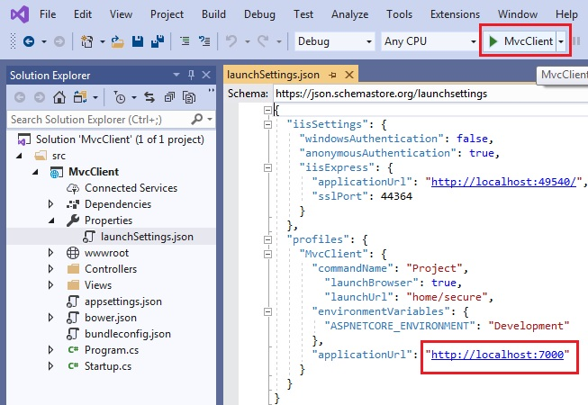
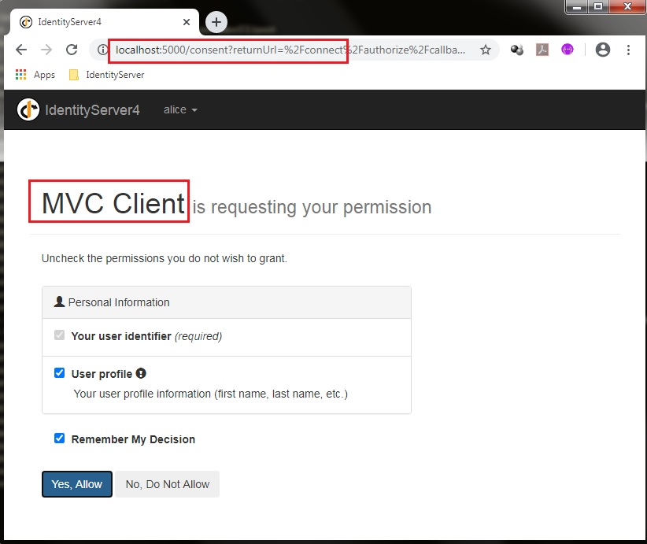
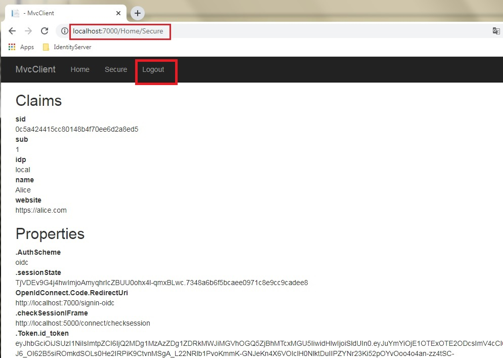
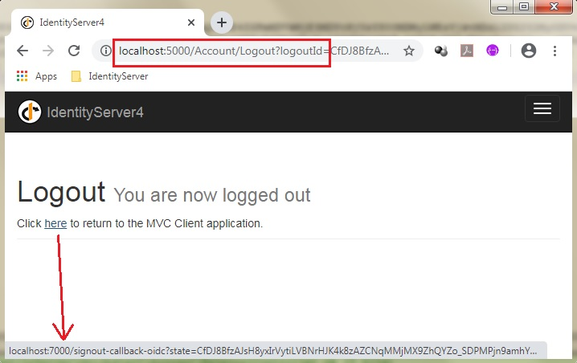

# Quickstart #3: User Authentication using OpenID Connect Implicit Flow

This quickstart adds support for interactive user authentication using the OpenID Connect implicit flow.

## Tutorial

The tutorial that goes along with this sample can be found here [Adding User Authentication with OpenID Connect](http://docs.identityserver.io/en/release/quickstarts/3_interactive_login.html)

The scenario is simple. Assume a user has registered in website B, but not in website A. And the user login website A with website B's credential, and share profile info from B to A.

In this Git code,we have 2 projects here, and each project has its own solution. By separating the project, we can easily debug each of them. The projects are:

- MvcClient: user wants to visit this website, but has not registered on it.
- IdentityServer: user has registered on it, with credential and profile.

After download the code, we are right to run it.

Start IdentityServer. Please notice: its applicationUrl is http://localhost:5000

Start MvcClient. Please notice, its applicationUrl is http://localhost:7000

After the above 2 project have launched, we can try to visit website of MvcClient. 

To show the authentication, we need to visit some sensitive pages, which is only available to logged-in user. And one of such pages is: http://localhost:7000/home/secure

Please be noted that, if the user has not logged in (this is default case), the sensitive page will not show, and browser will be redirected to another login page. And the login page is from IdentityServer project.

After input the username and password (which are hardcoded in the IdentityServer code), and click "Login" button, we will get the following permission-granting page.

On the above page, click "Yes, Allow" button, user will be redirected back to MvcClient page, which is expected at first.

On MvcClient website pages, user can logout as well. If click the "Logout" button, user will be logged-out from both of MvcClient and IdentityServer. On this sample, the page will stop at IdentityServer, but it has a link back to MvcClient.

