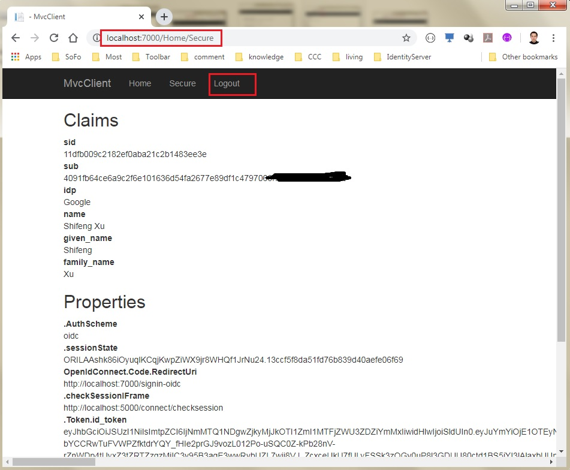

# Quickstart #4: Adding external Authentication

This quickstart adds support for Google authentication.

## Tutorial

The tutorial that goes along with this sample can be found here [Adding Support for External Authentication](http://docs.identityserver.io/en/release/quickstarts/4_external_authentication.html)

The scenario is simple. Assume a user has registered in website B, but not in website A. And the user login website A with website B's credential, and share profile info from B to A.

In this Git code,we have 2 projects here, and each project has its own solution. By separating the project, we can easily debug each of them. The projects are:

- MvcClient: user wants to visit this website, but has not registered on it.
- IdentityServer: user has registered on it, with credential and profile.

After download the code, we are right to run it.

Start IdentityServer. Please notice: its applicationUrl is http://localhost:5000

Start MvcClient. Please notice, its applicationUrl is http://localhost:7000

After the above 2 project have launched, we can try to visit website of MvcClient. 

Visit the page http://localhost:7000 , and it should be like this:

Click the link "Click to login", it will redirect to the login page:

We will use the external authentication, so here we click "Google" in the "External Login" panel on the right side. Then it may popup a window asking you to login Google account (if you have not logged in Google in current browser). And it may ask your permission to share Google profile with client.

Finally, we get this page:

On the above page, click "Yes, Allow" button, user will be redirected back to MvcClient page, which is expected at first.

On MvcClient website pages, user can logout as well. If click the "Logout" button, user will be logged-out from both of MvcClient and IdentityServer. On this sample, the page will stop at IdentityServer, but it has a link back to MvcClient.

