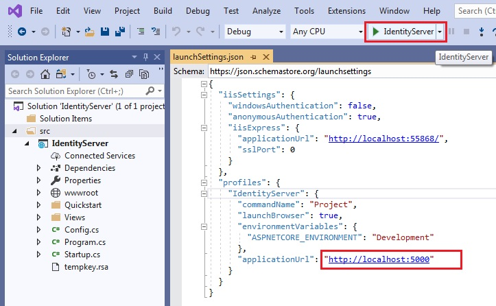
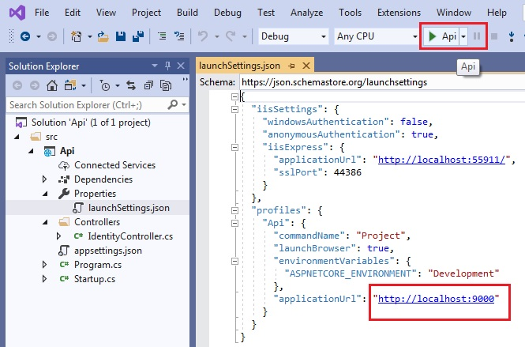
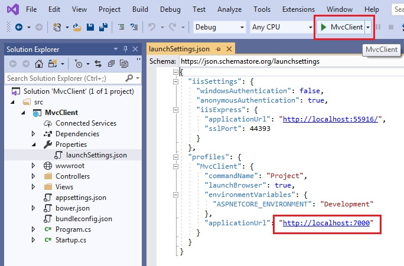
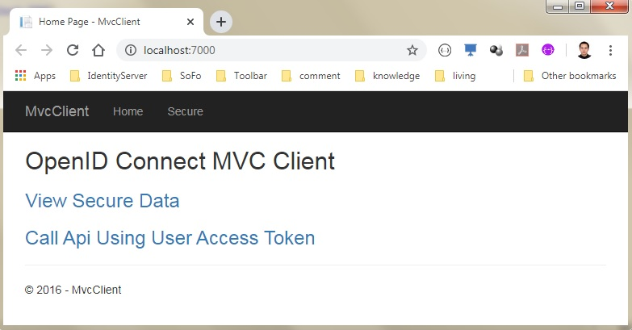
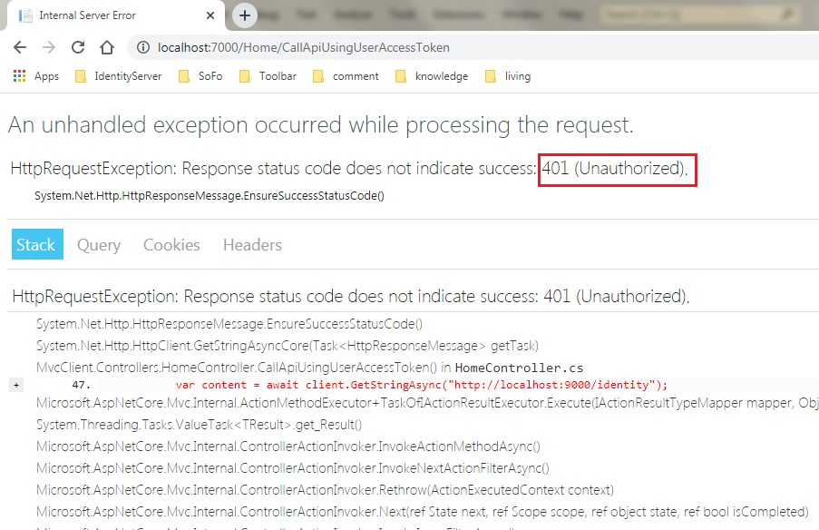
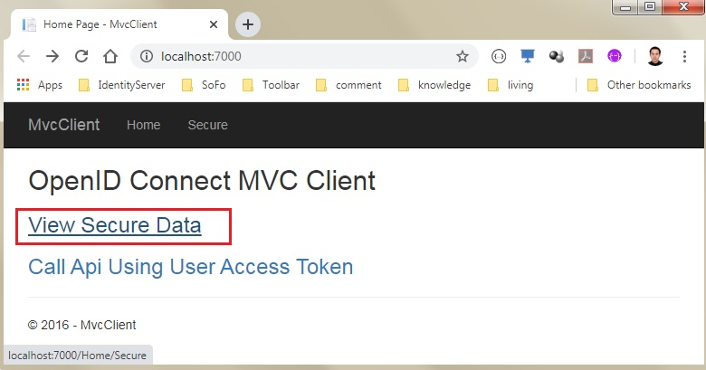
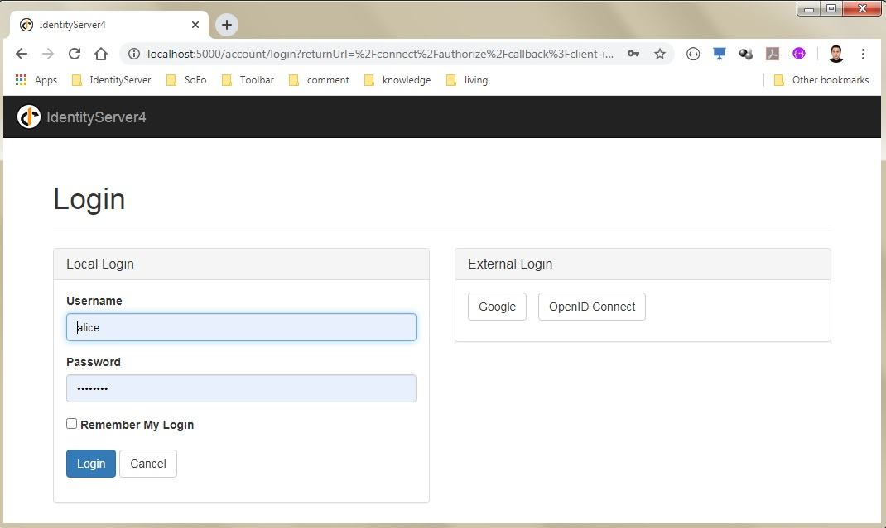
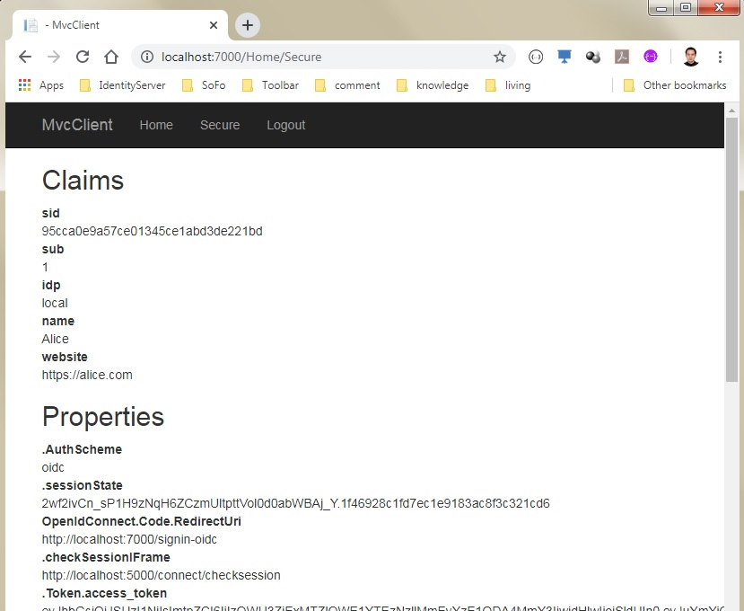
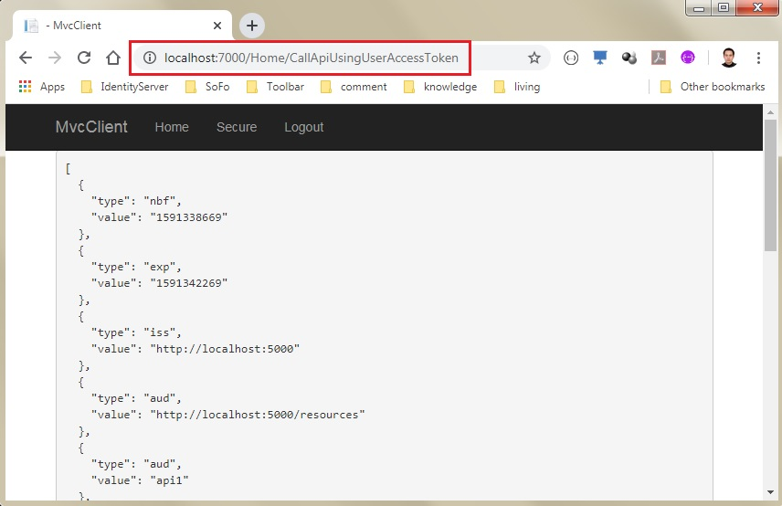

# Quickstart #5: OpenID Connect Hybrid Flow Authentication and API Access Tokens

This quickstart we combine what we learned in the previous quickstarts and we explored both API access and user authentication. 

## Tutorial

The tutorial that goes along with this sample can be found here [Switching to Hybrid Flow and adding API Access back](http://docs.identityserver.io/en/release/quickstarts/5_hybrid_and_api_access.html)

This section consist of 3 projects, and each project has its own VS solution.
- IdentityServer
- Api
- MvcClient

Start IdentityServer project. Please note, its applicationUrl is http://localhost:5000

Start Api project. Please note, its applicationUrl is http://localhost:9000

Start MvcClient project. Please note, its applicationUrl is http://localhost:7000

Here is the default page of MvcClient project.

So far the use has not logged-in. So if click the link of "Call Api Using Access Token", it will return 401 error as below

Get back to the home page of MvcClient, and click "View Secure Data".

Then the browser is redirected to the IdentityServer page, asking user to login. Use "alice" to login. In fact, the username and password is hard-coded in the IdentityServer project.

After login the IdentityServer, the browser will be redirected back to MvcClient page. And now we can view the secure data.

Get back to the home page of MvcClient, and click the link of "Call Api Using Access Token" again. This time we get the result from the API.

